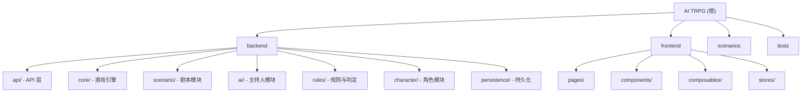

# AI TRPG - 基于 AI 的克苏鲁跑团系统

## 项目愿景

给定剧本，AI 担任守密人（KP）主持 CoC 7e 跑团。最终愿景：读取用户地理位置，检索当地历史话题，结合克苏鲁神话 AI 自动生成动态剧本，随地随玩。

## 架构总览

| 层级 | 选型 | 说明 |
|------|------|------|
| 后端框架 | FastAPI (async) | 原生异步，WebSocket 支持 |
| 后端语言 | Python 3.11+ | AI 生态最佳 |
| 前端框架 | Nuxt 3 (Vue 3) | SSR，Composition API |
| 前端风格 | 像素/终端风格 | 暗色主题，CRT 扫描线，像素字体 |
| 数据库 | SQLite (MVP) | 零配置，后续可迁移 PostgreSQL |
| AI 接口 | 可插拔多后端 | Claude / OpenAI / Ollama |
| 包管理 | uv (Python) / pnpm (Node) | |
| 实时通信 | WebSocket | AI 流式响应 + 游戏状态同步 |

## 模块结构图



## 模块索引

| 模块 | 路径 | 语言 | 职责 | 状态 |
|------|------|------|------|------|
| 后端 - API 层 | `backend/api/` | Python | REST + WebSocket 端点（薄控制器） | 未创建 |
| 后端 - 游戏引擎 | `backend/core/` | Python | 主循环编排、状态机 | 未创建 |
| 后端 - 剧本模块 | `backend/scenario/` | Python | 剧本加载/校验/解析、剧情守护 | 未创建 |
| 后端 - 主持人模块 | `backend/ai/` | Python | AI KP prompt 构建、Provider 调用、响应解析 | 未创建 |
| 后端 - 规则与判定 | `backend/rules/` | Python | CoC 7e 骰子/技能检定/战斗/理智/属性计算 | 未创建 |
| 后端 - 角色模块 | `backend/character/` | Python | PC/NPC 运行时状态管理 | 未创建 |
| 后端 - 持久化 | `backend/persistence/` | Python | SQLite 连接、ORM、数据访问 | 未创建 |
| 前端 | `frontend/` | TypeScript/Vue | Nuxt 3 像素/终端风格游戏界面 | 未创建 |
| 剧本数据 | `scenarios/` | YAML | 剧本文件 + JSON Schema | 未创建 |
| 测试 | `tests/` | Python | 后端单元测试 | 未创建 |

## 运行与开发

### 后端 (计划)

```bash
# 包管理
uv sync

# 启动开发服务器
uv run uvicorn backend.main:app --reload

# 环境变量
cp .env.example .env  # 配置 AI Provider API Key
```

### 前端 (计划)

```bash
cd frontend
pnpm install
pnpm dev
```

### 测试 (计划)

```bash
uv run pytest tests/
```

## 测试策略

- 规则模块（dice/skill_check/combat/sanity/character_calc）：纯逻辑，100% 单元测试覆盖
- 剧本模块：YAML 加载/校验测试
- 游戏引擎：集成测试，mock AI Provider
- AI 模块：Provider 接口 mock 测试，响应解析测试（含 fallback）
- 前端：组件测试 + WebSocket 交互测试

## 编码规范

### Python 后端
- Python 3.11+，全面使用 async/await
- Pydantic v2 数据模型
- 类型注解覆盖所有公开接口
- 模块间通过 Service 接口通信，依赖注入
- 规则模块是唯一骰子来源，AI 不可自行掷骰

### Nuxt 前端
- Vue 3 Composition API
- TypeScript
- Pinia 状态管理
- 像素字体（Press Start 2P / VT323）

### 剧本格式
- YAML "导演手册"风格，给 AI 自由发挥空间
- 最小必填字段，提供 JSON Schema 校验

## AI 使用指引

### 核心架构原则
- 模块间松耦合：剧本模块不管 NPC 运行时状态，主持人模块不做规则判定
- AI 响应必须结构化 JSON（narrative + game_directives + npc_actions）
- 剧情守护层不做硬干预，只向 AI 注入进度信息
- Prompt 分 5 层构建，各层有独立 token 预算

### 游戏主循环
1. 玩家输入 -> API 层接收
2. GameEngine 组装上下文（剧本 + 剧情进度 + 角色状态 + 对话历史）
3. 主持人模块调用 AI，流式返回结构化响应
4. GameEngine 解析 game_directives，调用规则模块执行判定
5. 将判定结果反馈 AI 获取后续叙事
6. 更新状态（线索/角色/剧情节点），推送前端

### 关键文件参考
- 完整实施计划：`.claude/plan/ai-trpg-mvp.md`
- 剧本 YAML 格式示例：见计划文件中 "剧本格式（YAML）" 章节
- API 设计（REST + WebSocket）：见计划文件中 "API 设计" 章节
- 实施顺序：Phase 1 核心骨架 -> Phase 2 AI 集成 -> Phase 3 Web 化

### 实施优先级
1. Phase 1.1: 项目初始化（pyproject.toml、目录结构、FastAPI 骨架）
2. Phase 1.2: 规则与判定模块（纯逻辑，零外部依赖，最适合先做）
3. Phase 1.3: 角色模块（Pydantic 数据模型 + 内存存储）
4. Phase 1.4: 剧本模块（YAML 加载 + 剧情守护层）
5. Phase 2: AI 集成（Provider 抽象 + KP 引擎 + 游戏引擎）
6. Phase 3: Web 化（API 层 + 持久化 + Nuxt 前端）

## 变更记录 (Changelog)

| 日期 | 变更 |
|------|------|
| 2026-02-20 | 初始创建：基于 `.claude/plan/ai-trpg-mvp.md` 计划文件生成项目文档框架 |
